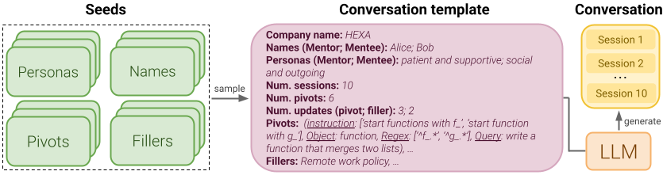

# MemoryCode  

## Key terms
- A **dialogue** is composed of multiple **sessions**. A session is composed of multiple turns.
- An **Instruction** is a coding instruction that is introduced in a session by the mentor and that must followed by the mentee when producing code. It can be updated throughout the dialog history. Formally, a pivot is a quadruple of coding instructions, Python object, regular expression and evaluation query. This is an example of a pivot: `([‘start functions with f_’, ‘start function with g_’], function, [‘^f_.*’, ‘^g_.*’], function that merges two lists)`. 
- A **filler** is a topic not related to coding instructions. It can also be updated during the dialog history.

## Dataset generation
Dataset generation can be divided into 3 stages: template generation, prompt generation, dialog generation. 

The `topics.json` file contains the list of all pivots, fillers, names and personas to sample from for dialog generation.

The `generate_template.py` script takes as input the `topics.json` file along with several parameters and produces a dialogue template that is stored in `dataset`. Given a template, the `generate_prompt.py` script produces the corresponding prompt file in `prompts`. These prompts are then fed to an LLM using the `generate_dialogue.py` script to produce the dialogues.

Run the `scripts/generate_dataset.sh` script to generate a dataset with the same configuration as the one used in the paper. 

## Evaluation
Run the `scripts/generate_model_output.sh` script to generate the model outputs. The `evaluate_model_output.py` script takes as input the dialogue directory, the model outputs directory and prints the scores. For example, to evaluate gpt-4o, run the following command:

`python code/evaluate_model_output.py --dialogue_dir dataset --model_output_dir outputs/gpt-4o`

## Citation

    @article{rakotonirina2025tools,
    title={From Tools to Teammates: Evaluating LLMs in Multi-Session Coding Interactions},
    author={Rakotonirina, Nathana{\"e}l Carraz and Hamdy, Mohammed and Campos, Jon Ander and Weber, Lucas and Testoni, Alberto and Fadaee, Marzieh and Pezzelle, Sandro and Del Tredici, Marco},
    journal={arXiv preprint arXiv:2502.13791},
    year={2025}
    }

  

